# This repository is the submission or Physical design course

## Skills learned

### Day 1: 
* Introduction to RISCV ISA
* Introduction OpenLANE
* Sky130 PDK

### Day 2:
* Core concepts of floor planing
    * Utilization factor and aspect ratio
    * Power Planning
    * Macro's wire and capacitance estimation
    * Floor Planning
    * Need of libraries and characterization
    * Congestion aware placement

### Day 3:
* Making a custom invertor and Plugging it into the OpenLANE environment
    * Making an Invertor
    * Doing Spice simulation to chek if the invertor is make properly
    * Pluging the invertor into OpenLANE flow

### Day 4:
* Making a LEF file from magic
* Intergration the LEF into openLANE
* Reducing the slew in the PnR flow

### Day 5:
* Power distribution network
* Routing
* DRC
* GDSII

___
## Day 1:
* RISCV is an open-source ISA by UC-Berkley
* OpenLANE is a complete RTL to GDSII flow by efables. It uses the following tools for the flow
    * Yosys & abc -> Synthesis
    * OpenSTA -> Static timing analysis
    * Fault -> DFT
    * OpenROAD App
        * Floorplanning
        * Placement
        * CTS (Clock tree synthesis)
        * Global routing
    * Custom scripts -> Antenna diode insertion
    * Yosys for a pre-routing LEC (Logical equivalance check)
    * TritonRoute -> Detailed Routing
    * RC extraction
    * OpenSTA again for a post routing timing analysis
    * Magic -> DRC (Design rule check and physical verification)
* Sky130 PDK

Sky130 PDK is an open-source PDK (Process Design Kit) by SkyWater and Google this is based on 130nm technology node.

**Day: 1 Task** In day-1 task we had to synthesis a design *picorv32a* by using OpenLANE in interactive mode.

Open up OpenLANE on your personal machine or on *Lab Instance*.
If you are on your personal machine you need to go into docker by using the following command:

```
    sudo docker run -it -v $(pwd):/openLANE_flow -v $PDK_ROOT:$PDK_ROOT -e PDK_ROOT=$PDK_ROOT -u $(id -u $USER):$(id -g $USER) openlane:rc4
```

Once in the docker make sure you are in the right directory then, go to interactive mode by using the following command

```
    ./flow.tcl -interactive
```

Include the package by using the following command

```
    package require openlane 0.9
```

After that you need to prepare your design files. In my case the design name was picorv32a the command I wrote was

```
    prep -design ./designs/picorv32a
```

After when the design is prepared run syntheis by using the following command

```
    run_synthesis
```

And I got the results as shown below.


---

## Day 2:
### Utilization factor
 It's the number of cells used by the design divided by
 the total number of cells availabe on the core. For example if you have a utilization factor of 1, that means we are using the complete core. In a typical design the utilization factor is about 0.65-0.75

 ### Aspect ratio
 Its the width of the core to the length of the core. This factor basically tells what is the shape of the core. For example if aspect ratio of the core is 1, that means the core is square shaped

 ### Power planing
 Power planning is an extremely import step in floor planning. If we have poor power planning when a array of gates try to go from 0-1 they draw too much current from the source. This causes a voltage drop of the source voltage. Similarly when the array is chaning from 1-0 they release this charge causing the source voltage to rise. One way to tackle this problem is by decoupling capacitors.
* We connect a capacitor in parallel from to a bigger combinatorial block this decouples the hardware from the source. Hence the name decoupling capacitor
    * When there is a high demand the capacitor provides this voltage
    * When there is a release of charge these capacitors take that charge keeping the noise in the voltage source as minimum as possible

These huge chunk of blocks are using quite alot in the design. So, we make then into macro's.

But when multiple macro's are connected together the inter-connect also need to supply voltage. This is done by having a grid of voltage and ground placed across the core, as shown in the fig.
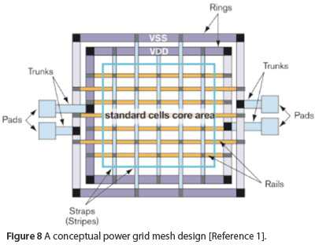

### Floor placement:
In order to place the standard cells at their respective place. We need to run placement on the synthesised design.
This can be done by the following command
```
run_placement
```
After placment a def-file is made in the floor plan directory.
This can be opened using magic by the following command.
```
magic -T <Tech file path> lef read <LEF file path> def read <DEF file path>
```
The view after running opening the def in magic is as follows
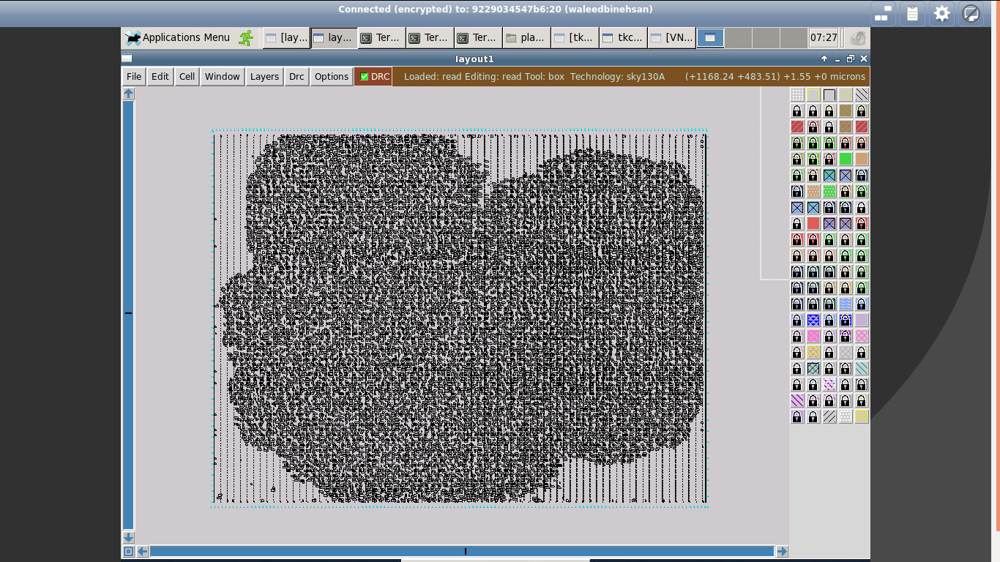

There are multiple types of timings that a circuit needs to hold, these timing information is covered in .lib file.

## Day 3:
First of all clone the design from git onto your system, by using the following command
```
git clone https://github.com/nickson-jose/vsdstdcelldesign.git
```
You will have the following files in your directory
* sky130_inv.mag
* libs directory

Open up your terminal and run magic with the required tech file in the libs directory.

This can be done by using the following command
```
magic -T /libs/sky130A.tech sky130_inv.mag
```

In the magic you will have a view such as following.
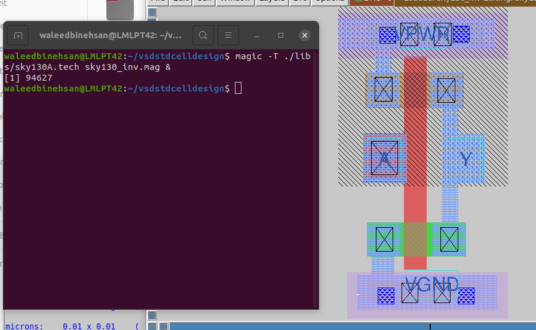

Next you would need to change the extract an ext from the layout, use the following command
```
extract all
```

After that remove all the parasatics and get a .spice file this can be done by the following command in the tkcon-window.
```
ext2spice cthresh 0 rthresh 0
ext2spice
```

After these you will have the .spice file as shown in the fig.
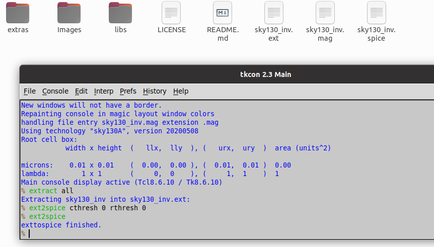

Open up the spice file and make a couple of changes accordingly
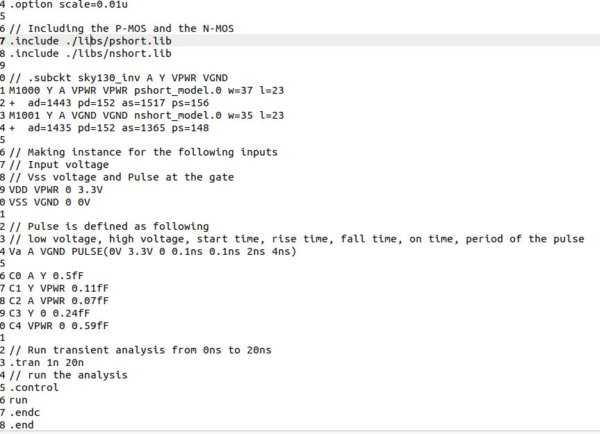


Now we need to run it onto ngspice, by ploting the y vs time while sweeping the input a. You will get a waveform such as following.
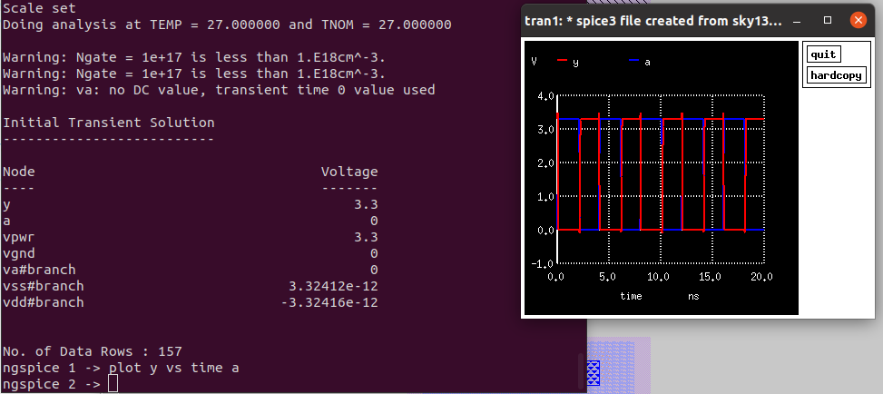


## Day 4:
The inverter that we made on day 3 we are going to convert it into LEF and after that we are going to embed it into openLANE flow. First open the .mag file and specify the port as shown below
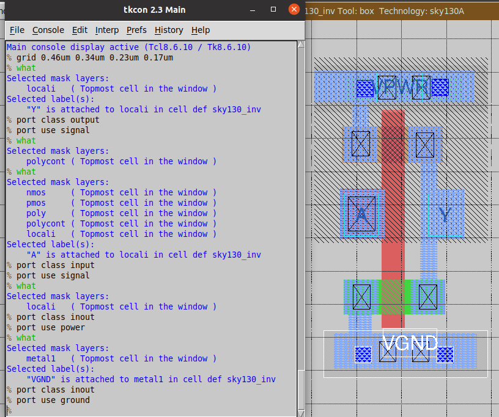

Now your ports are ready save it with a respect name using the following command tkcon window
```
save sky130_vsdinv.mag
```

Then write it into a LEF file using the following command
```
lef write <Name of the file you want to save with>
```

So you will have a .lef file move the .lef and the libs files to the design/src folder your src directory will look something like the following
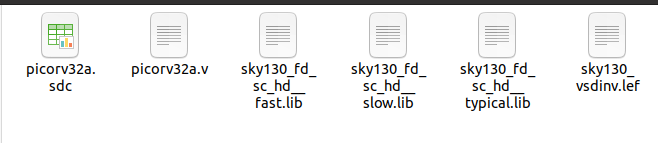

Now change your config.tcl file to include your cell as follows
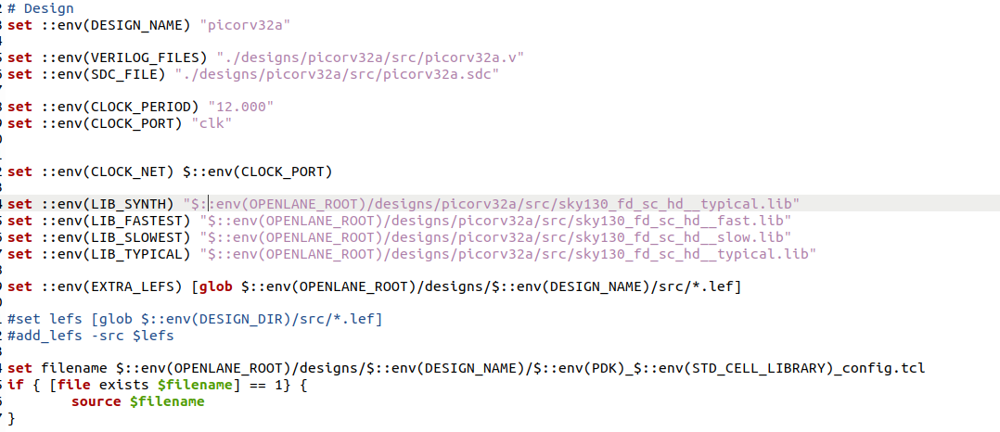

After this you are set to make the design. Open up docker and go to interactive mode similar to day 1.

After this prep your design. Then enter the following 2 commands
```
set lefs [glob $::env(DESIGN_DIR)/src/*.lef]
add_lefs -src $lefs
```

After this run synthesis by
```
run_synthesis
```

Your terminal will look something like this
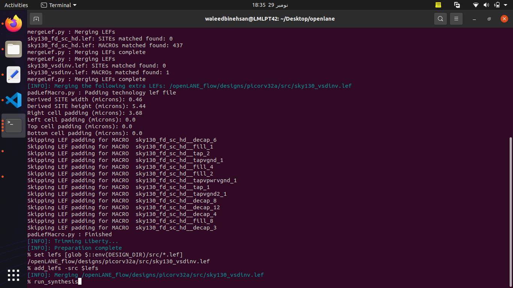

After running the synthesis your report will have your cell included with in it as shown

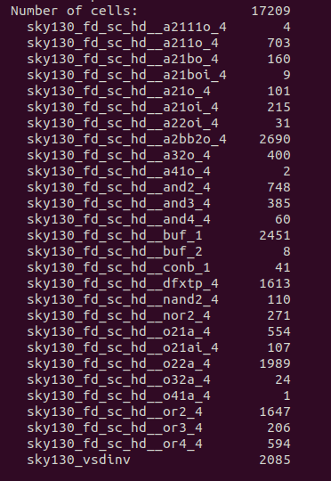


After the iterating the PnR flow I got the slew as shown in figure
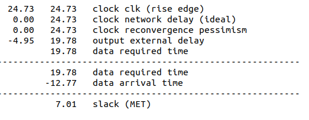

Now, run floor-plan by running the following command. By using the following command
```
run_floorplan
```

Now, run placement by running the following command. By using the following command
```
run_placement
```

Now lets build a clock tree synthesis, by running the following command
```
run_cts
```
A window such as the following will show up
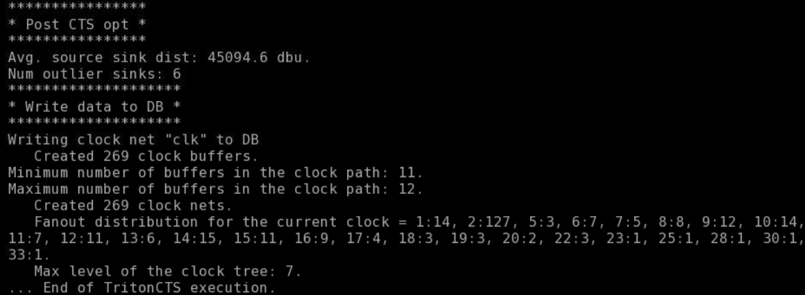

Now, lets start openroad and start the timing analysis. This is done by the following commands
```
read_db pico_sv_cts.db
read_verilog <Absolute path where your verilog is>
read_liberty -max $::env(LIB_MAX)
read_sdc <sdc in your src folder>
```

We got the slack as shown in fig
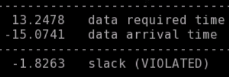

Now we need to do ECO to remove paths where slack is the most.

The slack violation of hold time is shown below in fig


In order to replace a cell from the netlist we can use the following command
```
echo $::env(CTS_CLK_BUFFER_LIST)
lreplace $::env(CTS_CLK_BUFFER_LIST) <Name of buffer> <Buffer to replace with>

set ::env(CTS_CLK_BUFFER_LIST) [lreplace $::env(CTS_CLK_BUFFER_LIST) <Name of buffer> <Buffer to replace with>]
```

## Day 5:
In openlane PDN is done after CTS, this is done by using the following command
```
gen_pdn
```

### Routing:
Now the final step to route all of it together, run the following command
```
run_routing
```

After routing DRC's are checked and then parasatics are removed by SPEC.

The final GDSII will be as following
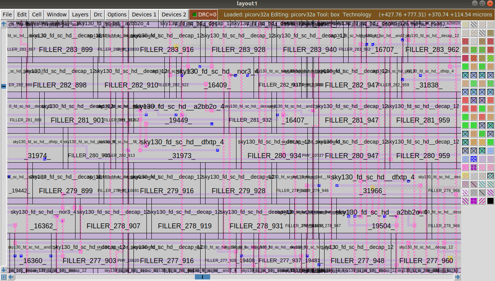
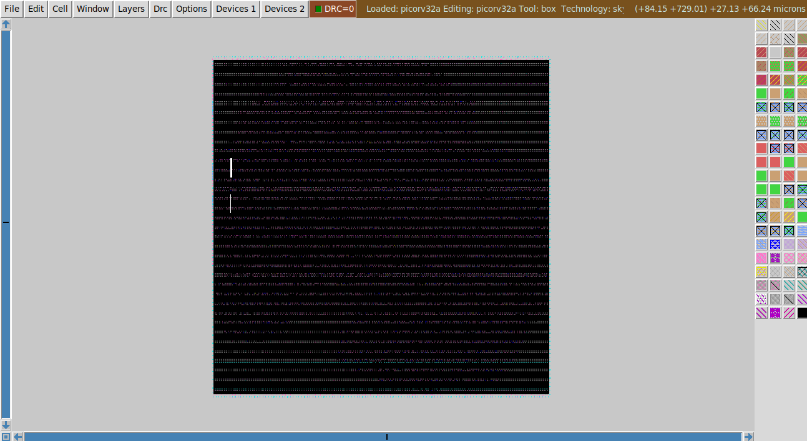
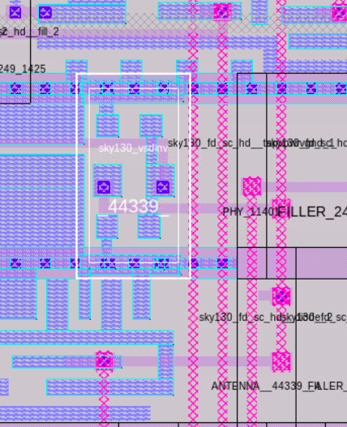


### Final Note
Thanks everyone especially

* Kunal Ghosh
* Nickson P Jose

Its was a very hectic, tought, full of learning and amazing 5-day. Hope to interact with all of you in near future. Have a great day.
:)

