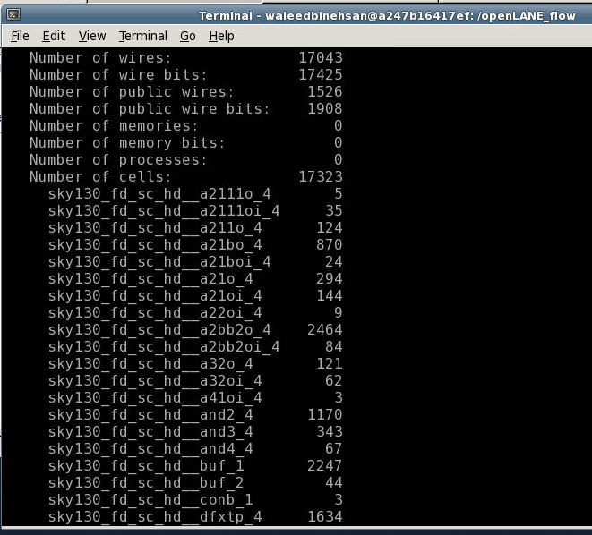

# This repository is the submission or Physical design course

## Skills learned

### Day 1: 
* Introduction to RISCV ISA
* Introduction OpenLANE
* Sky130 PDK

___
## Day 1:
* RISCV is an open-source ISA by UC-Berkley
* OpenLANE is a complete RTL to GDSII flow by efables. It uses the following tools for the flow
    * Yosys & abc -> Synthesis
    * OpenSTA -> Static timing analysis
    * Fault -> DFT
    * OpenROAD App
        * Floorplanning
        * Placement
        * CTS (Clock tree synthesis)
        * Global routing
    * Custom scripts -> Antenna diode insertion
    * Yosys for a pre-routing LEC (Logical equivalance check)
    * TritonRoute -> Detailed Routing
    * RC extraction
    * OpenSTA again for a post routing timing analysis
    * Magic -> DRC (Design rule check and physical verification)
* Sky130 PDK

Sky130 PDK is an open-source PDK (Process Design Kit) by SkyWater and Google this is based on 130nm technology node.

**Day: 1 Task** In day-1 task we had to synthesis a design *picorv32a* by using OpenLANE in interactive mode.

Open up OpenLANE on your personal machine or on *Lab Instance*.
If you are on your personal machine you need to go into docker by using the following command:

```
    sudo docker run -it -v $(pwd):/openLANE_flow -v $PDK_ROOT:$PDK_ROOT -e PDK_ROOT=$PDK_ROOT -u $(id -u $USER):$(id -g $USER) openlane:rc4
```

Once in the docker make sure you are in the right directory then, go to interactive mode by using the following command

```
    ./flow.tcl -interactive
```

Include the package by using the following command

```
    package require openlane 0.9
```

After that you need to prepare your design files. In my case the design name was picorv32a the command I wrote was

```
    prep -design ./designs/picorv32a
```

After when the design is prepared run syntheis by using the following command

```
    run_synthesis
```

And I got the results as shown below.


